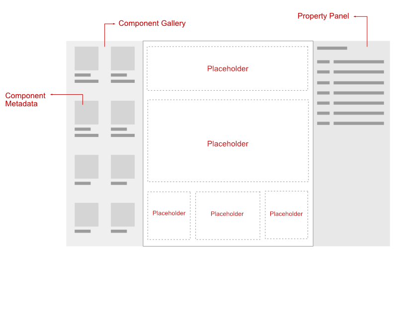
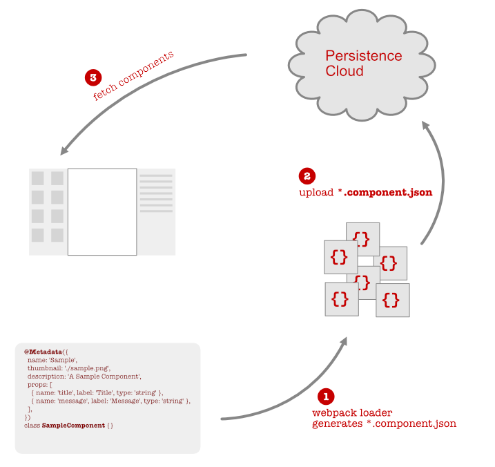

# Automating Component-publishing with a Webpack-loader


In a project that I'm currently working on, we are building a Site-Authoring system that allows
authors to design pages with templates and React Components. The templates have placeholders in them that are
eventually filled with some defined Components from the Component Gallery. These components have
metadata, which is used to render the `title`, `description`, and `thumbnail`. Additionally, they
will have `properties` which can be configured in the _Property Panel_.



One part of this system consists of a workflow to publish the components to the
gallery. It requires defining metadata for all the components that can be used during authoring
. This metadata needs to be uploaded to some persistence layer, so that the gallery can pull it from there.


## Defining Metadata

Every component will need some metadata to become identifiable and usable from the component
-gallery. This metadata can be defined as static `json`. One option is to keep a separate `<component>.json` file
next to the `<component>.jsx`. However there is an overhead of keeping the two files in sync.

Although the metadata should not change that often, it is still good to co-locate this metadata
as close as possible to the `Component` definition itself. We could do this with a decorator like
`@Metadata` on the `Component` class. The only caveat is that decorators can only be attached to
`classes` / `properties` / `methods` but not to top-level functions. This means you can't do it on
your
`Function-Components` and will need to wrap it in a class or define as a class-component or create
a dummy-class solely to define the metadata. We think that's a small price to pay for co-location.

Below is a sample class-component with the `@Metadata`. Notice that the `properties` are defined
as an
array with details about each prop. These are the configurable props, which will show up on the
_Property Panel_ of the _Authoring app_. The `type` field of each prop will determine the _field
-editor_.

```js
import React from 'react';

@Metadata({
  name: 'Sample',
  thumbnail: './sample.png',
  description: 'A Sample Component',
  properties: [
    { name: 'title', label: 'Title', type: 'string' },
    { name: 'message', label: 'Message', type: 'string' },
  ],
})
class SampleComponent extends React.Component {}
```

## Extracting the metadata to publish

Just defining the metadata is not going to be useful. We need to have a way to publish this
metadata to the persistence layer. Only then can the _component-gallery_ fetch it to render all
the components.

Part of this job will be handled by a **Webpack-loader**. The loader would read the `@Metadata`
decorator and generate an artifact (`<name>.component.json`). Equipped with these `*.component.json` files, we can have a build step that would upload them to the persistence layer. The
overall flow looks like so:



## The Webpack loader

Let's call our loader as the `metadata-loader`. It will be part of our Webpack build and
specified as the first loader that gets to read our source files. Loaders in Webpack can be
chained and are specified in a reverse order as shown below from our `webpack.config.js`.

```js
const path = require('path');

module.exports = {
  entry: './sample/index.js',
  output: {
    path: path.resolve('./build'),
    filename: 'sample.js',
  },
  module: {
    rules: [
      {
        test: /\.js$/,
        use: [
          /* used last */ 'babel-loader',
          /* used first in chain*/ path.resolve('./lib/index.js'),
        ],
      },
    ],
  },
};
```

In the above config, the second loader for `*.js` files is our `metadata-loader`. Since it is
specified last, it will have the first shot at the source file, before piping the output to the
`babel-loader`. To learn more about webpack loaders, you can peruse the [fantastic documentation
](https://webpack.js.org/api/loaders/).

## Writing the loader

This part was frankly the most fun part of the project. The webpack documentation was great in
getting started and after that it was the usual research on _StackOverflow_, _Medium_ and other
forums.

This loader will be the first to process the source files, since we don't want any
transpilation from babel. In order to read the decorator, we will have to rely on the **AST**
(**A**bstract **S**yntax **T**ree) to traverse and extract details from the decorator. For this
, we used the [`@babel/parser`](https://babeljs.io/docs/en/babel-parser),
[`@babel/traverse`](https://babeljs.io/docs/en/babel-traverse) and
[`@babel/generator`](https://babeljs.io/docs/en/babel-generator) to generate
the final code stripping the decorator.

> We are stripping the decorator because there is no need for it after the component metadata is
> extracted.

Here is the part of the loader, that reads the AST, extracts the decorator, and finally strips it
from the AST. Using this pruned AST, we generate the code that is sent to the next loader in
the pipeline.

```js
const parser = require('@babel/parser');
const traverse = require('@babel/traverse').default;
const generator = require('@babel/generator').default;

module.exports = function(source) {
  // Parse to get the AST
  const ast = parser.parse(source, {
    sourceType: 'module',
    plugins: [
      'jsx',
      [
        'decorators',
        {
          decoratorsBeforeExport: false,
        },
      ],
    ],
  });

  // The current context is the loader and contains methods to emitError, emitFile etc.
  const loader = this;

  // Visit the AST, specifically the ClassDeclaration, which has the decorator
  traverse(ast, {
    ClassDeclaration: ({ node }) => {
      const name = node.id.name;

      const result = getMetadata(node.decorators || []);
      if (!result) return;

      const { decorator, args } = result;

      // Strip out the decorator from the AST
      node.decorators = node.decorators.filter(x => x !== decorator);
      if (node.decorators.length === 0) {
        delete node.decorators;
      }

      const options = {
        name,
        ...args,
        env: {
          context: loader.context,
        },
      };

      // Validate that the options are correctly specified, such the name, description, thumbnail.
      // Also checks that the thumbnail file actually exists
      if (!validateOptions(options, name, loader)) return;

      loader.emitFile(
        `${options.name}.component.json`,
        JSON.stringify(options, null, 4),
      );
    },
  });

  const { code } = generator(ast);
  return code;
};
```

There are a few things happening here:

1. Parse the given source to generate the AST
1. Traverse the AST and visit the `ClassDeclaration` nodes that contain the `@Metadata` decorator
1. Validate the options in the `@Metadata`, specifically ensuring the `thumbnail` file exists
1. Strip out the matched decorator. There is no use for it post this loader.
1. If all goes well, generate the `*.component.json` file for each `@Metadata` instance.

> Read the full source code of the loader [here](lib/index.js).

## Publishing the metadata

So far we have seen that the loader generates the `*.component.json` files, which all lie in the
`build` directory. To publish the metadata to the persistence layer, we built a simple Node.js
script that uploads all the `*.component.json` files to the storage endpoint. This completes the
workflow for publishing.
The same endpoint is also used for fetching the metadata on the Authoring App.

## Summary

Although the idea of using a webpack-loader seems obvious in hindsight, it wasn't the case when
we were still exploring how the metadata should be defined. The metadata being static required
us to debate the merits / demerits of choosing plain _JSON_ files over a **decorator**.

Ultimately
the co-location benefit made us adopt the decorator based approach. It's true that there is
more work needed to build the loader, but the overall automation that we could achieve was
totally worth it.

**Note**: In this iteration, we have not focused on _component versioning_ as we want the Authors to use the latest components.
I’ve skipped a few details on the consumption of these components in the Authoring App. This is to keep the focus on the loader rather than the App.

> The markdown was converted to a Medium post using [this converter](http://markdown-to-medium.surge.sh/).
